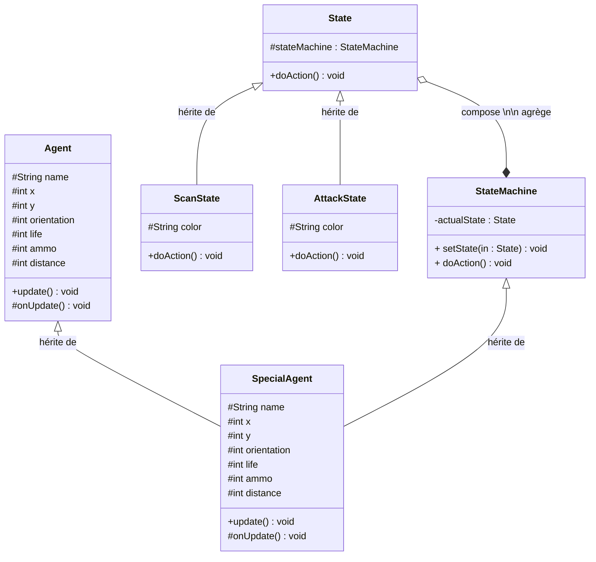
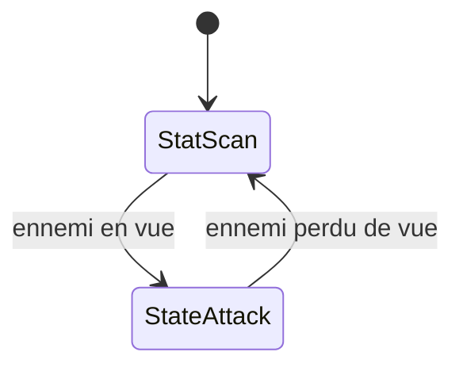

# POO-Agent
Cours POO et C++

```mermaid

classDiagram
    State o--*  StateMachine : compose \n\n agrège
    State <|--  ScanState : hérite de
    State <|--  AttackState : hérite de
    Agent <|-- SpecialAgent : hérite de
    StateMachine <|--  SpecialAgent : hérite de


    class SpecialAgent{
        #String name
        #int x
        #int y
        #int orientation
        #int life
        #int ammo
        #int distance
        +update() void  
        #onUpdate() void
    }
    class Agent{
        #String name
        #int x
        #int y
        #int orientation
        #int life
        #int ammo
        #int distance
        +update() void
        #onUpdate() void
    }
    class StateMachine{
        -actualState : State
        + setState(in : State) void
        + doAction() void
    }

    class State{
        #stateMachine : StateMachine
        +doAction() void
    }

    class ScanState{
        #String color
        +doAction() void
    }

    class AttackState{
        #String color
        +doAction() void
    }

```

```mermaid
stateDiagram-v2
    [*] --> StatScan
    StatScan --> StateAttack : ennemi en vue
    StateAttack --> StatScan : ennemi perdu de vue

```