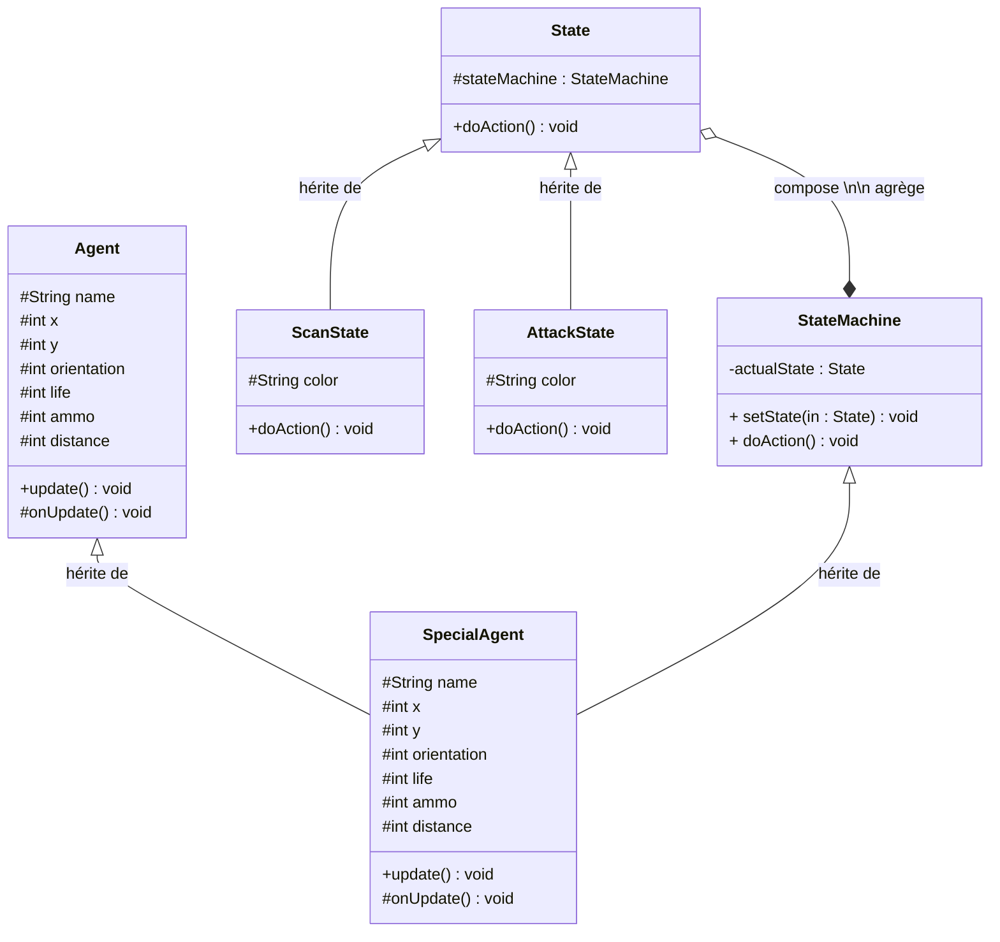
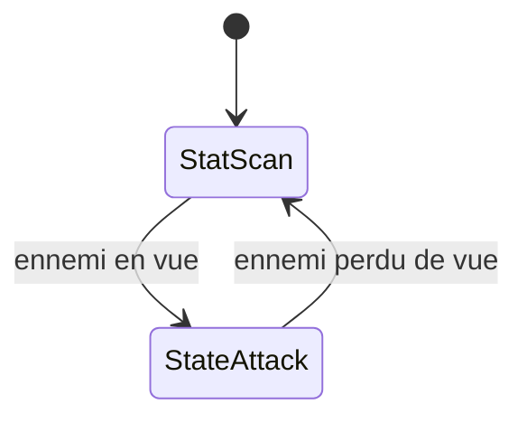

# POO-Agent
Cours POO et C++

Exercice 1 : Spécial agent utilisant le patron State

Le SpecialAgent Hérite des classes Agent et StateMachine, StateMachine compose de State qui elle meme hérite des états ScanState et AttackState.

ScanState est l'état initiale de l'agent (couleur verte, se déplace et s’oriente de manière pseudo-aléatoire) et passe en AttackState (couleur rouge, se déplace vers ennemi et lui tire dessus) si un ennemi est en vue.

